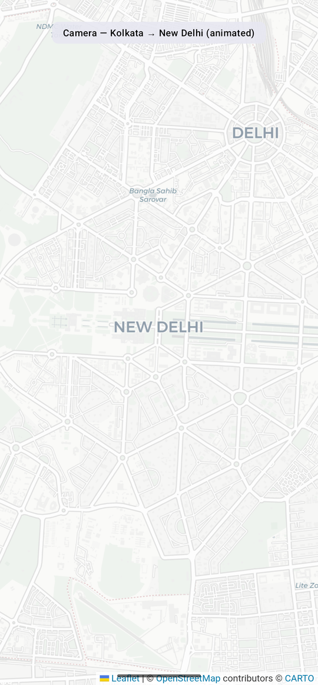
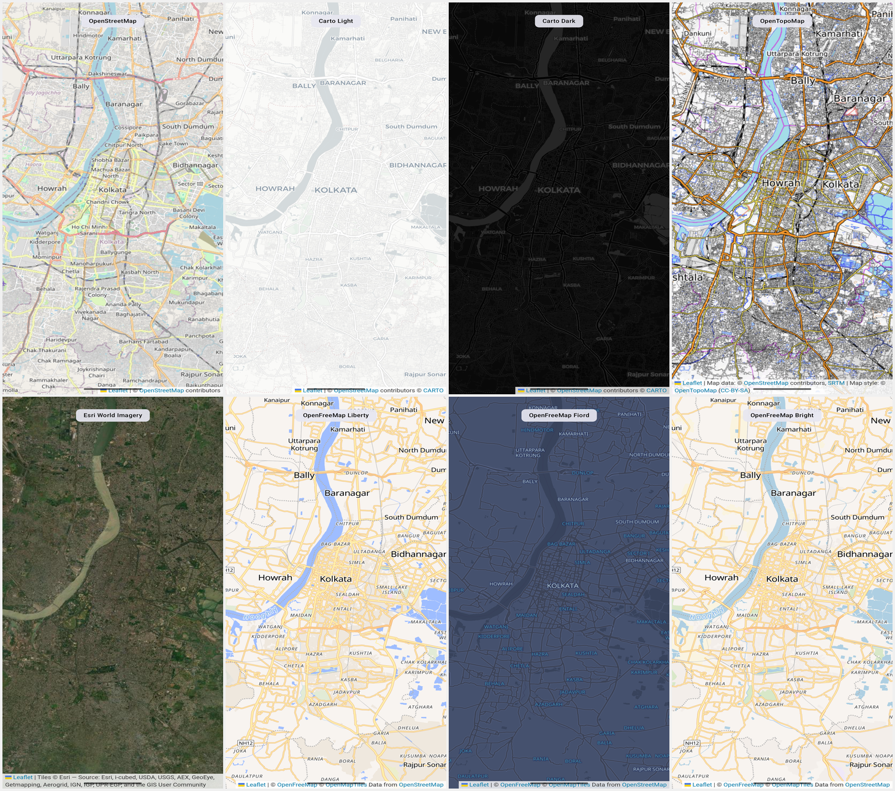
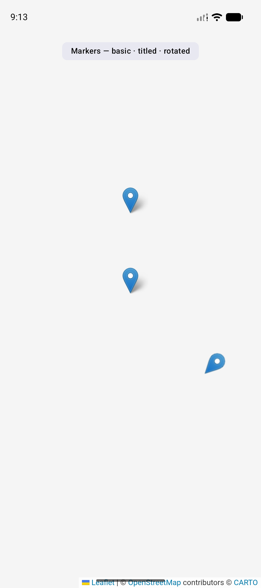
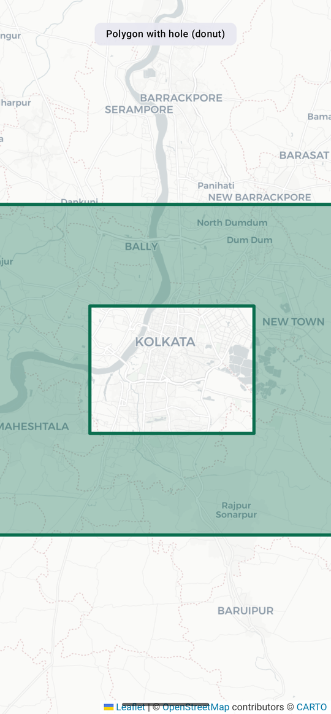
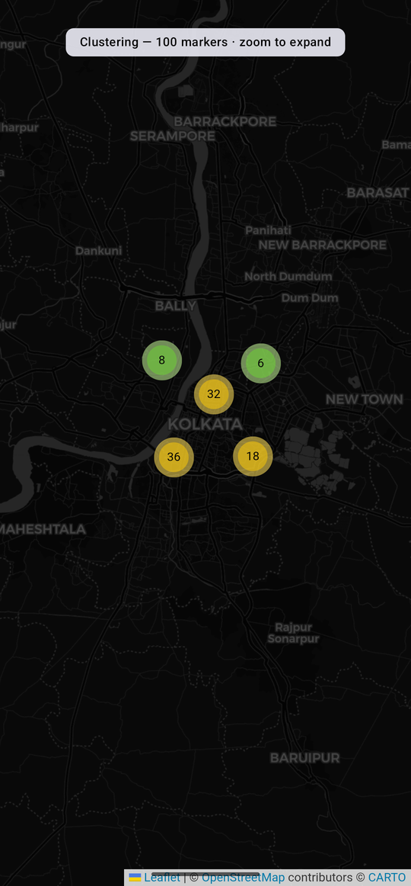
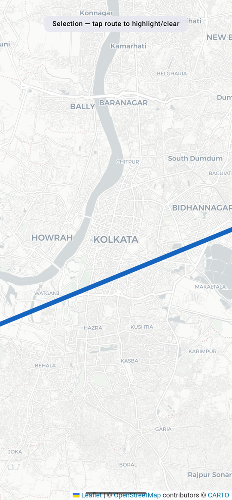

# LeafleKT

LeafleKT is a Kotlin Multiplatform Leaflet.js SDK — a UI-free core, Compose Multiplatform UI layer, and a native Swift Package for iOS.


[](https://central.sonatype.com/artifact/io.github.binayshaw7777/leaflekt-compose)
[](https://android-arsenal.com/api?level=21)
[](LICENSE)


---

## Table of Contents

- [Features](#features)
- [Installation](#installation)
- [Requirements](#requirements)
- [Quick Start](#quick-start)
- [Camera State](#camera-state)
- [Map Properties](#map-properties)
- [Map UI Settings](#map-ui-settings)
- [Markers](#markers)
- [Custom Marker Icons](#custom-marker-icons)
- [Polylines](#polylines)
- [Polygons](#polygons)
- [Circles](#circles)
- [Marker Clustering](#marker-clustering)
- [GeoJSON Overlays](#geojson-overlays)
- [Selection State](#selection-state)
- [Imperative Controller](#imperative-controller)
- [Color System](#color-system)
- [iOS / Swift Package](#ios--swift-package)
- [Migration from Legacy](#migration-from-legacy)
- [Legal](#legal)
- [License](#license)

---

## Features

- Map rendering via `WebView` / `WKWebView` with a Kotlin/Swift JavaScript bridge
- Declarative Compose API: markers, polylines, polygons, circles
- Hoisted state for camera, shapes, and selection
- 8 built-in tile styles: raster (OSM, Carto Light/Dark, Topo, Esri Imagery) + vector (OpenFreeMap Liberty/Fiord/Bright)
- GeoJSON boundary overlays (India built-in + custom)
- Marker clustering via Leaflet.markercluster
- Custom marker icons (base64 or URL)
- Stroke patterns: dash, dot, gap
- Polygon holes support
- Imperative controller for programmatic control
- KMP core module with zero Compose dependency
- Native Swift Package for iOS

---

## Installation

### Compose Multiplatform or Android Compose

```kotlin
dependencies {
    implementation("io.github.binayshaw7777:leaflekt-compose:1.1.0")
}
```

### KMP without shared UI (core only)

```kotlin
dependencies {
    implementation("io.github.binayshaw7777:leaflekt-core:1.1.0")
}
```

### iOS — Swift Package Manager

In Xcode: **File → Add Package Dependencies**, paste:

```
https://github.com/binayshaw7777/LeafleKT
```

Select version `v1.1.0` → add `LeaflektMap` target to your app.

---

## Requirements

| Platform | Minimum |
|----------|---------|
| Android  | API 21+ |
| iOS      | iOS 15+ |
| Kotlin   | 2.x     |
| Compose  | 1.7+    |

---

## Quick Start


```kotlin
@Composable
fun MyMap() {
    val cameraPositionState = rememberLeaflektCameraPositionState {
        position = LeaflektCameraPosition(
            target = LeaflektLatLng(latitude = 22.5726, longitude = 88.3639),
            zoom = 12.0
        )
    }

    LeaflektMap(
        modifier = Modifier.fillMaxSize(),
        cameraPositionState = cameraPositionState,
        properties = LeaflektMapProperties(mapStyle = LeaflektMapStyle.OpenStreetMap),
        uiSettings = LeaflektMapUiSettings(zoomControlsEnabled = true),
        onMapClick = { latLng -> println("Clicked: $latLng") }
    ) {
        LeaflektMarker(
            position = LeaflektLatLng(22.5726, 88.3639),
            title = "Kolkata",
            snippet = "City of Joy"
        )
    }
}
```

---

## Camera State



Camera state is hoisted — own it, drive it, observe it.

```kotlin
val cameraPositionState = rememberLeaflektCameraPositionState {
    position = LeaflektCameraPosition(
        target = LeaflektLatLng(28.6139, 77.2090),
        zoom = 10.0
    )
}

// Read current position
val currentZoom = cameraPositionState.position.zoom
val isMoving = cameraPositionState.isMoving

// Move programmatically
cameraPositionState.move(
    target = LeaflektLatLng(19.0760, 72.8777),
    zoom = 14.0
)

// Animate programmatically
cameraPositionState.animate(
    target = LeaflektLatLng(19.0760, 72.8777),
    zoom = 14.0,
    durationMillis = 1500
)
```

### Camera callbacks

```kotlin
LeaflektMap(
    cameraPositionState = cameraPositionState,
    onCameraMoveStarted = { /* drag/zoom started */ },
    onCameraMove = { /* camera moving */ },
    onCameraIdle = { /* camera settled */ },
    onMapLoaded = { /* Leaflet initialized */ },
)
```

### LeaflektCameraPosition

| Field | Type | Description |
|-------|------|-------------|
| `target` | `LeaflektLatLng` | Center coordinate |
| `zoom` | `Double` | Zoom level (0–19+) |

---

## Map Properties

```kotlin
LeaflektMap(
    properties = LeaflektMapProperties(
        mapStyle = LeaflektMapStyle.CartoDark,
        geoJsonOverlay = LeaflektGeoJsonOverlay.India,
        tileBufferSize = 8  // optional — auto-detected from device RAM by default
    )
)
```

### LeaflektMapProperties fields

| Property | Type | Default | Description |
|----------|------|---------|-------------|
| `mapStyle` | `LeaflektMapStyle` | `OpenStreetMap` | Tile provider and style |
| `geoJsonOverlay` | `LeaflektGeoJsonOverlay` | `India` | Boundary overlay |
| `tileBufferSize` | `Int` | auto (RAM-based) | Leaflet `keepBuffer` — tiles kept outside viewport. Auto-selects 4/8/12 based on device RAM (<2 GB / 2–4 GB / >4 GB) |

### Available Map Styles



| Style | Description |
|-------|-------------|
| `LeaflektMapStyle.OpenStreetMap` | Default OSM tiles |
| `LeaflektMapStyle.CartoLight` | Clean light basemap |
| `LeaflektMapStyle.CartoDark` | Dark basemap |
| `LeaflektMapStyle.OpenTopoMap` | Topographic map |
| `LeaflektMapStyle.EsriWorldImagery` | Satellite imagery |
| `LeaflektMapStyle.OpenFreeMapLiberty` | OpenFreeMap Liberty vector tiles |
| `LeaflektMapStyle.OpenFreeMapFiord` | OpenFreeMap Fiord vector tiles |
| `LeaflektMapStyle.OpenFreeMapBright` | OpenFreeMap Bright vector tiles |

Switch style at runtime via controller:

```kotlin
LeaflektMap(
    onReady = { controller ->
        controller.setMapStyle(LeaflektMapStyle.CartoDark)
    }
)
```

---

## Map UI Settings


```kotlin
LeaflektMap(
    uiSettings = LeaflektMapUiSettings(
        zoomControlsEnabled = true,
        scrollGesturesEnabled = true,
        zoomGesturesEnabled = true,
        showCurrentLocation = true,
        myLocationButtonEnabled = true
    )
)
```

| Setting | Type | Default | Description |
|---------|------|---------|-------------|
| `zoomControlsEnabled` | `Boolean` | `true` | Show +/- zoom buttons |
| `scrollGesturesEnabled` | `Boolean` | `true` | Enable pan gestures |
| `zoomGesturesEnabled` | `Boolean` | `true` | Enable pinch-to-zoom |
| `showCurrentLocation` | `Boolean` | `false` | Show blue dot at device location |
| `myLocationButtonEnabled` | `Boolean` | `false` | Show center-on-me button |
| `currentLocationIcon` | `LeaflektCurrentLocationIcon?` | `null` | Custom location dot icon |

### Custom location icon

```kotlin
LeaflektMapUiSettings(
    showCurrentLocation = true,
    currentLocationIcon = LeaflektCurrentLocationIcon(
        pngBytes = myPngByteArray,
        widthPx = 48,
        heightPx = 48,
        anchorFractionX = 0.5f,
        anchorFractionY = 0.5f
    )
)
```

---

## Markers



### Simple marker

```kotlin
LeaflektMap(...) {
    LeaflektMarker(
        position = LeaflektLatLng(22.5726, 88.3639),
        title = "Kolkata",
        snippet = "West Bengal, India"
    )
}
```

### Hoisted marker state

```kotlin
val markerState = rememberLeaflektMarkerState(
    position = LeaflektLatLng(22.5726, 88.3639)
)

LeaflektMap(...) {
    LeaflektMarker(
        state = markerState,
        title = "Draggable Marker"
    )
}

// Move marker from outside
Button(onClick = { markerState.position = LeaflektLatLng(28.6, 77.2) }) {
    Text("Move")
}
```

### Marker parameters

| Parameter | Type | Default | Description |
|-----------|------|---------|-------------|
| `state` / `position` | `LeaflektMarkerState` / `LeaflektLatLng` | — | Marker location |
| `title` | `String?` | `null` | Popup title |
| `snippet` | `String?` | `null` | Popup subtitle |
| `icon` | `LeaflektMarkerIconInfo?` | `null` | Custom icon |
| `rotationDegrees` | `Float` | `0f` | Visual rotation |
| `visible` | `Boolean` | `true` | Show/hide |
| `alpha` | `Float` | `1.0f` | Opacity (0–1) |
| `zIndex` | `Int` | `0` | Draw order |
| `id` | `String` | auto | Stable identifier |
| `onClick` | `() -> Boolean` | `{ false }` | Return `true` to consume event |

### Marker click handling

```kotlin
LeaflektMap(
    onMarkerClick = { markerId -> println("Marker $markerId tapped") }
) {
    LeaflektMarker(
        position = LeaflektLatLng(22.5726, 88.3639),
        id = "home-marker",
        onClick = {
            println("Home marker tapped")
            true // consume — prevents map click from firing
        }
    )
}
```

---

## Custom Marker Icons


Icons are passed as data URIs (base64 PNG) or HTTPS URLs.

### From base64

```kotlin
val iconBase64 = "data:image/png;base64,iVBORw0KGgo..." // your base64 string

LeaflektMarker(
    position = LeaflektLatLng(22.5726, 88.3639),
    icon = LeaflektMarkerIconInfo(
        dataUrl = iconBase64,
        widthPx = 48,
        heightPx = 48,
        anchorFractionX = 0.5f,  // horizontal anchor (0=left, 1=right)
        anchorFractionY = 1.0f   // vertical anchor (0=top, 1=bottom)
    )
)
```

### From URL

```kotlin
LeaflektMarker(
    position = LeaflektLatLng(22.5726, 88.3639),
    icon = LeaflektMarkerIconInfo(
        dataUrl = "https://example.com/pin.png",
        widthPx = 32,
        heightPx = 32,
        anchorFractionX = 0.5f,
        anchorFractionY = 1.0f
    )
)
```

### Rotated vehicle icon

```kotlin
LeaflektMarker(
    position = LeaflektLatLng(22.5726, 88.3639),
    title = "Vehicle",
    rotationDegrees = 90f,
    icon = LeaflektMarkerIconInfo(
        dataUrl = carIconBase64,
        widthPx = 40,
        heightPx = 40,
        anchorFractionX = 0.5f,
        anchorFractionY = 0.5f
    )
)
```

---

## Polylines


### Simple polyline

```kotlin
LeaflektMap(...) {
    LeaflektPolyline(
        points = listOf(
            LeaflektLatLng(22.5726, 88.3639),
            LeaflektLatLng(22.5826, 88.3939),
            LeaflektLatLng(22.6026, 88.4239)
        ),
        color = Color(0xFF1565C0),
        width = 8f
    )
}
```

### Dashed / dotted pattern

```kotlin
LeaflektPolyline(
    points = routePoints,
    color = Color(0xFFE53935),
    width = 6f,
    pattern = listOf(
        LeaflektStrokePattern.Dash(length = 15f),
        LeaflektStrokePattern.Gap(length = 10f)
    )
)
```

### Polyline parameters

| Parameter | Type | Default | Description |
|-----------|------|---------|-------------|
| `points` | `List<LeaflektLatLng>` | — | Route coordinates |
| `color` | `Color` | `Color.Black` | Stroke color |
| `width` | `Float` | `10f` | Stroke width in px |
| `pattern` | `List<LeaflektStrokePattern>?` | `null` | Dash/dot pattern |
| `geodesic` | `Boolean` | `false` | Follow earth curvature |
| `visible` | `Boolean` | `true` | Show/hide |
| `alpha` | `Float` | `1f` | Opacity (0–1) |
| `zIndex` | `Float` | `0f` | Draw order |
| `clickable` | `Boolean` | `false` | Enable click events |
| `selected` | `Boolean` | `false` | Highlight state |
| `selectedColor` | `Color` | Blue | Color when selected |
| `selectedWidth` | `Float` | `width + 4f` | Width when selected |
| `onClick` | `() -> Unit` | `{}` | Click handler |

### Stroke patterns

```kotlin
LeaflektStrokePattern.Dash(length = 20f)    // dash segment
LeaflektStrokePattern.Gap(length = 10f)      // gap between segments
LeaflektStrokePattern.Dot(radius = 3f)       // dot
```

Combine them freely in a list:

```kotlin
pattern = listOf(
    LeaflektStrokePattern.Dot(radius = 4f),
    LeaflektStrokePattern.Gap(length = 8f)
)
```

---

## Polygons



### Simple polygon

```kotlin
LeaflektMap(...) {
    LeaflektPolygon(
        points = listOf(
            LeaflektLatLng(22.55, 88.30),
            LeaflektLatLng(22.55, 88.45),
            LeaflektLatLng(22.65, 88.45),
            LeaflektLatLng(22.65, 88.30)
        ),
        fillColor = Color(0x330B6E4F),
        strokeColor = Color(0xFF0B6E4F),
        strokeWidth = 4f,
        fillOpacity = 0.3f
    )
}
```

### Polygon with holes (donut shape)

```kotlin
LeaflektPolygon(
    points = outerBoundary,
    holes = listOf(innerHole1, innerHole2),
    fillColor = Color(0x55FF5722),
    strokeColor = Color(0xFFFF5722),
    strokeWidth = 3f
)
```

### Polygon parameters

| Parameter | Type | Default | Description |
|-----------|------|---------|-------------|
| `points` | `List<LeaflektLatLng>` | — | Outer boundary vertices |
| `holes` | `List<List<LeaflektLatLng>>` | `emptyList()` | Inner cutout boundaries |
| `fillColor` | `Color` | `Color.Transparent` | Fill color |
| `fillOpacity` | `Float` | `0.2f` | Fill opacity (0–1) |
| `strokeColor` | `Color` | `Color.Black` | Border color |
| `strokeWidth` | `Float` | `10f` | Border width |
| `strokeOpacity` | `Float` | `1f` | Border opacity (0–1) |
| `strokePattern` | `List<LeaflektStrokePattern>?` | `null` | Dash/dot border |
| `geodesic` | `Boolean` | `false` | Geodesic edges |
| `visible` | `Boolean` | `true` | Show/hide |
| `zIndex` | `Float` | `0f` | Draw order |
| `clickable` | `Boolean` | `false` | Enable click |
| `selected` | `Boolean` | `false` | Highlight state |
| `onClick` | `() -> Unit` | `{}` | Click handler |

---

## Circles


```kotlin
LeaflektMap(...) {
    LeaflektCircle(
        center = LeaflektLatLng(22.5726, 88.3639),
        radiusMeters = 500.0,
        fillColor = Color(0x332196F3),
        strokeColor = Color(0xFF2196F3),
        strokeWidth = 3f,
        fillOpacity = 0.25f
    )
}
```

### Circle parameters

| Parameter | Type | Default | Description |
|-----------|------|---------|-------------|
| `center` | `LeaflektLatLng` | — | Circle center |
| `radiusMeters` | `Double` | `10.0` | Radius in meters |
| `fillColor` | `Color` | `Color.Transparent` | Fill color |
| `fillOpacity` | `Float` | `0.2f` | Fill opacity (0–1) |
| `strokeColor` | `Color` | `Color.Black` | Outline color |
| `strokeWidth` | `Float` | `10f` | Outline width |
| `strokeOpacity` | `Float` | `1f` | Outline opacity (0–1) |
| `strokePattern` | `List<LeaflektStrokePattern>?` | `null` | Dash/dot outline |
| `visible` | `Boolean` | `true` | Show/hide |
| `zIndex` | `Float` | `0f` | Draw order |
| `clickable` | `Boolean` | `false` | Enable click |
| `selected` | `Boolean` | `false` | Highlight state |
| `onClick` | `() -> Unit` | `{}` | Click handler |

---

## Marker Clustering



Group many markers into clusters that expand on zoom.

```kotlin
val markers = List(100) { index ->
    LeaflektMarkerInfo(
        id = "marker-$index",
        lat = 22.5726 + (index * 0.01),
        lng = 88.3639 + (index * 0.01),
        title = "Point $index"
    )
}

LeaflektMap(...) {
    LeaflektMarkerCluster(
        id = "my-cluster",
        markers = markers,
        maxClusterRadius = 80  // px radius for grouping
    )
}
```

### LeaflektMarkerInfo fields

| Field | Type | Default | Description |
|-------|------|---------|-------------|
| `id` | `String?` | `null` | Stable identifier |
| `lat` | `Double` | — | Latitude |
| `lng` | `Double` | — | Longitude |
| `title` | `String?` | `null` | Popup title |
| `snippet` | `String?` | `null` | Popup subtitle |
| `visible` | `Boolean` | `true` | Show/hide |
| `alpha` | `Float` | `1.0f` | Opacity |
| `zIndex` | `Int` | `0` | Draw order |
| `rotationDegrees` | `Float` | `0f` | Visual rotation |
| `icon` | `LeaflektMarkerIconInfo?` | `null` | Custom icon |

---

## GeoJSON Overlays


Overlay regional boundaries directly on the map.

```kotlin
// Built-in India boundary
LeaflektMapProperties(
    geoJsonOverlay = LeaflektGeoJsonOverlay.India
)

// Custom GeoJSON string
LeaflektMapProperties(
    geoJsonOverlay = LeaflektGeoJsonOverlay.Custom(
        geojson = """{ "type": "FeatureCollection", ... }"""
    )
)

// No overlay
LeaflektMapProperties(
    geoJsonOverlay = LeaflektGeoJsonOverlay.None
)
```

Switch overlay at runtime:

```kotlin
controller.setGeoJsonOverlay(LeaflektGeoJsonOverlay.India)
```

---

## Selection State



Polylines, polygons, and circles support a selected state that visually highlights the shape with a different color and width.

```kotlin
val polylineState = rememberLeaflektPolylineState(points = routePoints)

LeaflektMap(...) {
    LeaflektPolyline(
        state = polylineState,
        color = Color(0xFF1565C0),
        width = 6f,
        selectedColor = Color(0xFFFF5722),
        selectedWidth = 10f,
        clickable = true,
        onClick = { polylineState.toggleSelection() }
    )
}

// Control from outside
Button(onClick = { polylineState.select() }) { Text("Highlight route") }
Button(onClick = { polylineState.deselect() }) { Text("Clear") }
```

Same API applies to `LeaflektPolygonState` and `LeaflektCircleState`.

---

## Imperative Controller

Access the full imperative API via `onReady`:

```kotlin
var mapController by remember { mutableStateOf<LeaflektController?>(null) }

LeaflektMap(
    onReady = { controller -> mapController = controller }
)
```

### Camera

```kotlin
controller.moveCamera(lat = 28.6139, lng = 77.2090, zoom = 14.0)
controller.animateCamera(lat = 28.6139, lng = 77.2090, zoom = 14.0, durationMillis = 1000)
controller.setZoomBounds(minZoom = 5.0, maxZoom = 18.0)
controller.centerOnCurrentLocation(zoom = 16.0)
```

### Map

```kotlin
controller.setMapStyle(LeaflektMapStyle.CartoDark)
controller.setGeoJsonOverlay(LeaflektGeoJsonOverlay.India)
controller.setZoomControlsEnabled(false)
controller.setScrollGesturesEnabled(false)
controller.setZoomGesturesEnabled(false)
```

### Markers

```kotlin
controller.addMarker(LeaflektMarkerInfo(id = "a", lat = 22.57, lng = 88.36))
controller.addMarkers(listOf(markerA, markerB, markerC))
controller.updateMarker(LeaflektMarkerInfo(id = "a", lat = 22.60, lng = 88.40))
controller.removeMarker("a")
controller.clearMarkers()
```

### Shapes

```kotlin
controller.addPolyline(LeaflektPolylineInfo(id = "route", points = routePoints))
controller.updatePolyline(updatedInfo)
controller.removePolyline("route")

controller.addPolygon(LeaflektPolygonInfo(id = "zone", points = boundary))
controller.updatePolygon(updatedInfo)
controller.removePolygon("zone")

controller.addCircle(LeaflektCircleInfo(id = "area", center = center, radiusMeters = 200.0))
controller.updateCircle(updatedInfo)
controller.removeCircle("area")
```

### Clustering

```kotlin
controller.createClusterGroup(groupId = "vehicles", maxClusterRadius = 60)
controller.addMarkersToCluster(groupId = "vehicles", markers = vehicleMarkers)
controller.removeClusterGroup("vehicles")
```

### Raw JavaScript

```kotlin
controller.executeJavaScript("map.setView([22.5726, 88.3639], 15);")
```

### Composition locals

Access the controller from any child composable without prop drilling:

```kotlin
@Composable
fun MyChild() {
    val controller = LocalLeaflektController.current
}
```

---

## Color System

`leaflekt-core` has no Compose dependency. Colors use `LeaflektColor`:

```kotlin
// Built-in constants
LeaflektColor.Black
LeaflektColor.White
LeaflektColor.Red
LeaflektColor.Blue
LeaflektColor.Green
LeaflektColor.Transparent

// From ARGB long
LeaflektColor.fromArgb(0xFF1565C0L)

// From RGB integers
LeaflektColor.fromRgb(red = 21, green = 101, blue = 192, alpha = 255)
```

In Compose modules, convert freely between `LeaflektColor` and `androidx.compose.ui.graphics.Color`:

```kotlin
// Compose Color → LeaflektColor
val lColor = Color(0xFF1565C0).toLeaflektColor()

// LeaflektColor → Compose Color
val cColor = LeaflektColor.Blue.toComposeColor()
```

Shape composables (LeaflektPolyline, LeaflektPolygon, LeaflektCircle) accept `Color` directly — conversion happens internally.

---

## iOS / Swift Package

### Basic map

```swift
import SwiftUI
import LeaflektMap

struct ContentView: View {
    @State private var position = LeaflektCameraPosition(
        target: LeaflektLatLng(latitude: 22.5726, longitude: 88.3639),
        zoom: 12
    )

    var body: some View {
        LeaflektMapView(position: $position)
            .mapProperties(LeaflektMapProperties(
                mapStyle: .cartoLight,
                geoJsonOverlay: .india
            ))
            .uiSettings(LeaflektMapUiSettings(
                zoomControlsEnabled: true,
                scrollGesturesEnabled: true,
                zoomGesturesEnabled: true
            ))
            .onMapClick { latLng in print("Tapped: \(latLng)") }
            .onCameraIdle { pos in print("Idle at zoom \(pos.zoom)") }
    }
}
```

### Imperative controller (iOS)

```swift
LeaflektMapView(position: $position)
    .onReady { controller in
        controller.moveCamera(lat: 28.6139, lng: 77.2090, zoom: 14)
        controller.setZoomBounds(min: 5, max: 18)

        controller.addMarker(LeaflektMarker(
            id: "delhi",
            position: LeaflektLatLng(latitude: 28.6139, longitude: 77.2090),
            title: "New Delhi"
        ))

        controller.addPolyline(LeaflektPolyline(
            id: "route",
            points: points,
            color: .blue,
            width: 6
        ))

        controller.addCircle(LeaflektCircle(
            id: "zone",
            center: LeaflektLatLng(latitude: 28.6139, longitude: 77.2090),
            radiusMeters: 500,
            strokeColor: .red,
            fillColor: UIColor.red.withAlphaComponent(0.2),
            strokeWidth: 3
        ))

        controller.createClusterGroup(groupId: "pins", maxClusterRadius: 80)
        controller.addMarkersToCluster(groupId: "pins", markers: myMarkers)
    }
```

### Map styles (Swift)

```swift
LeaflektMapStyle.openStreetMap
LeaflektMapStyle.cartoLight
LeaflektMapStyle.cartoDark
LeaflektMapStyle.openTopoMap
LeaflektMapStyle.esriWorldImagery
LeaflektMapStyle.openFreeMapLiberty
LeaflektMapStyle.openFreeMapFiord
LeaflektMapStyle.openFreeMapBright
```

### Custom marker icon (iOS)

```swift
let icon = LeaflektMarkerIcon(
    dataUrl: "https://example.com/pin.png",  // or data:image/png;base64,...
    widthPx: 48,
    heightPx: 48,
    anchorFractionX: 0.5,
    anchorFractionY: 1.0
)

controller.addMarker(LeaflektMarker(
    id: "custom",
    position: LeaflektLatLng(latitude: 22.5726, longitude: 88.3639),
    icon: icon
))
```

---

## Migration from Legacy

Version 1.0 replaces the old `leaflekt` Android module and renames all public symbols.

### Dependency changes

| Before | After |
|--------|-------|
| JitPack `com.github.binayshaw7777:leaflekt` | Maven Central `io.github.binayshaw7777:leaflekt-compose` |
| — | `io.github.binayshaw7777:leaflekt-core` (KMP without Compose) |

### API renames

| Before | After |
|--------|-------|
| `MapView` | `LeaflektMap` |
| `MapController` | `LeaflektController` |
| `LatLng` | `LeaflektLatLng` |
| `CameraPosition` | `LeaflektCameraPosition` |
| `MapProperties` | `LeaflektMapProperties` |
| `MapUiSettings` | `LeaflektMapUiSettings` |
| `MapStyle` | `LeaflektMapStyle` |
| `Marker` | `LeaflektMarker` |
| `Polyline` | `LeaflektPolyline` |
| `Polygon` | `LeaflektPolygon` |
| `Circle` | `LeaflektCircle` |

### Color migration

```kotlin
// Before — Compose Color passed directly to core
polylineColor: Color.Red

// After — use LeaflektColor in core models
color: LeaflektColor.Red

// OR convert from Compose Color
color: Color.Red.toLeaflektColor()
```

See [MIGRATION.md](MIGRATION.md) for complete symbol mapping.

---

## Legal

- LeafleKT is not affiliated with Google, Leaflet, or OpenStreetMap.
- Leaflet.js is licensed separately under its own terms.
- Map tile usage and attribution remain the responsibility of the consuming app.
- All tile providers (OSM, Carto, Esri, OpenTopoMap) have individual usage terms — review them before shipping to production.

---

## License

Apache License 2.0. See [LICENSE](LICENSE).
